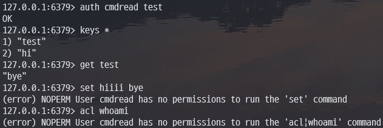

## ACL 기능 실습

### 유저 설정

#### 1. redis.conf

- `redis.conf` 파일 내에 `user useranme on/off >password ~keypattern +cmd`로 유저 생성

  ```
  bind 0.0.0.0
  port 6379
  dir /data
  user default on >test ~* +@all
  user confuser1 on >pass1 ~* +@read +@write
  user confuser2 on >pass2 ~hi* +@read
  ```

  - docker container 실행
    ```
    docker run -d --name redis \n
    -v {경로}/redis.conf:/usr/local/etc/redis/redis.conf \n
    redis:latest \n
    redis-server /usr/local/etc/redis/redis.conf
    ```

- <b>Result :</b>

   

<br>

#### 2. `ACL SETUSER` 명령어

- `ACL SETUSER useranme on/off >password ~keypattern +cmd`

   

<br>
<br>

---

<br>

### 접근 제어

#### 1. 명령어 제어

- user 설정할 때 `+cmd`로 명령어 접근 범위 제어
  - 모든 권한 허용이면 `+@all`
  - `-cmd`로 권한 제거
- `ACL CAT`로 확인한 명령어 카테고리를 통해 카테고리 단위로 제어 가능

  - `+@category` / `-@category`

- read, write 권한 유저 생성

   

- read 권한 허용 유저 테스트

   

- read, write 권한 허용 유저 테스트

   

- <b>선택자</b>

  - 규칙을 여러 개 지정할 때 `()` 선택자 사용

     

<br>

#### 2. 키 제어

- user 설정할 때 `~KEY_PATTERN`로 키 접근 범위 제어
- redis 7.0부터 `%PERMISSION~KEY_PATTERN`로 키에 대한 권한 종류도 지정 가능

  - Permission : 읽기(%R), 쓰기(%W)

   
